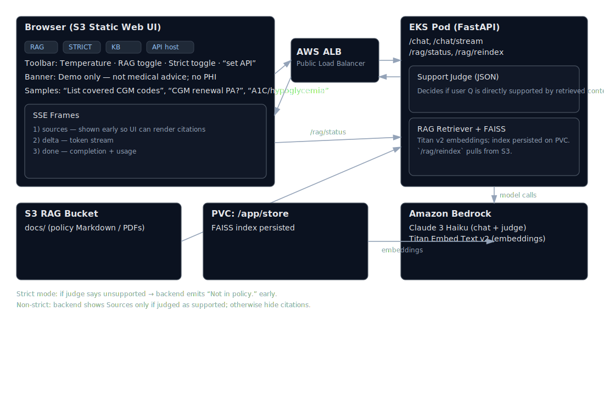

# EKS Chat (Bedrock) — Streaming + RAG Demo

A tiny streaming chat app that runs on **AWS EKS**, serves a static **web UI on S3**, calls **Amazon Bedrock** (Claude 3 Haiku), and optionally performs **RAG** using **Titan Embeddings v2** + **FAISS**. It’s designed to be easy to demo and cheap to run.

> **Demo intent only.** Not medical advice. Do not put PHI in the system.

---

## Features

- ⚡ **Streaming responses** (SSE) — feels fast and fluid
- 🧠 **RAG** (toggle in UI) — Titan Embeddings v2 + FAISS on a PVC or rebuilt from S3
- 🧩 **System prompt + temperature** controls (persist in localStorage)
- ☁️ **Deployable via Makefile + Helm** (ECR, EKS, ALB, S3 static site)
- 🔐 **/rag/reindex** protected by a shared token (`RAG_TOKEN`)

---

## Architecture

The architecture below is also available as `architecture.svg` in the repo.



High‑level:

- **Frontend**: S3 static website (`web/`) calling the API
- **Backend**: FastAPI container on EKS (streaming SSE)
- **Models**: Bedrock (Claude 3 Haiku), Titan Embeddings v2
- **RAG**: FAISS index persisted under `/app/store` (PVC), able to rebuild from S3
- **Auth**: `/rag/reindex` requires `X-RAG-Token`

---

## Prerequisites

- AWS account + CLI configured
- Tools: `docker`, `kubectl`, `helm`, `eksctl`, `jq`, `make`
- **Bedrock access** in your region (us‑east‑1) for:
  - `anthropic.claude-3-haiku-20240307-v1:0`
  - `amazon.titan-embed-text-v2:0`

---

## Quick Start (Local)

1. **Install deps**
   ```bash
   python -m venv .venv && source .venv/bin/activate
   pip install -r requirements.txt
   ```

2. **Run API**
   ```bash
   export AWS_REGION=us-east-1
   export MODEL_ID=anthropic.claude-3-haiku-20240307-v1:0
   export USE_LANGCHAIN=false     # optional; forces raw boto3 path for /chat
   uvicorn app.main:app --reload --port 8000
   ```

3. **Open UI**
   - Edit `web/config.js` and set:
     ```js
     window.API_BASE_URL = 'http://localhost:8000';
     ```
   - Open `web/index.html` in your browser.
   - Or add `?api=http://localhost:8000` to the URL.

---

## Deploy to EKS

**One‑time** create a cluster and bootstrap IAM:

```bash
make cluster-up           # EKS cluster + OIDC + bedrock invoke policy + SA
```

**Build & push** the image to ECR:

```bash
TAG=0.5 make build-push
```

**Create RAG bucket** and seed demo content (optional but recommended):

```bash
make rag-bucket           # creates s3://<cluster>-rag-<acct>-<region>/docs/demo.md
make rag-iam              # creates/attaches S3 read policy to the workload role
```

**Deploy the app** (sets env & creates ALB Service):

```bash
RAG_TOKEN='your-strong-token' TAG=0.5 make deploy
make url   # prints API base URL (ALB hostname)
```

---

## Frontend Website (S3)

Create a public S3 static website (demo‑only approach):

```bash
make frontend-up
# Point the web UI at your API (ALB hostname)
echo "window.API_BASE_URL = 'http://<ALB_HOSTNAME>'" > web/config.js
make frontend-deploy
make frontend-url   # prints the website URL
```

> **Note:** For production, prefer CloudFront + OAI/WAF instead of a public S3 website.

---

## RAG Admin & Data

**Index from S3**:

```bash
# Upload / update documents
aws s3 sync data/ s3://<your-rag-bucket>/docs/

# Rebuild the FAISS index in the pod from S3
curl -sS -X POST "$API_URL/rag/reindex" \
  -H "X-RAG-Token: $RAG_TOKEN" | jq .
```

**Status / Debug Search**:

```bash
curl -sS "$API_URL/rag/status" | jq .
curl -sS "$API_URL/rag/search?q=glp-1%20renewal&k=3" | jq .
```

**Using RAG in chat**: toggle “RAG” in the UI, or:

```bash
curl -sS -X POST "$API_URL/chat" \
  -H 'Content-Type: application/json' \
  -d '{"messages":[{"role":"user","content":"List covered CGM codes"}],"rag":true}' | jq .
```

**Streaming**:

```bash
curl -N -X POST "$API_URL/chat/stream" \
  -H 'Content-Type: application/json' \
  -d '{"messages":[{"role":"user","content":"Do I need prior auth for CGM and how often?"}],"rag":true,"temperature":0.2}'
```

---

## Configuration (env)

| Var             | Default                                           | Notes                                                     |
|-----------------|---------------------------------------------------|-----------------------------------------------------------|
| `AWS_REGION`    | `us-east-1`                                       | Must match Bedrock and S3 region                          |
| `MODEL_ID`      | `anthropic.claude-3-haiku-20240307-v1:0`          | Claude 3 Haiku via Bedrock                                |
| `USE_LANGCHAIN` | `true`                                            | `false` to force raw boto3 path for `/chat`               |
| `RAG_S3_BUCKET` | *(none)*                                          | e.g. `eks-chat-rag-<acct>-us-east-1`                      |
| `RAG_S3_PREFIX` | `docs/`                                           | Folder under bucket                                       |
| `RAG_TOKEN`     | *(empty)*                                         | If set, required for `/rag/reindex`                       |

Helm chart sets these with `--set env.*=...`.

---

## Costs & Cleanup

Rough hourly costs (us‑east‑1, estimates):
- EKS control plane: ~**$0.10/h**
- ALB: ~**$0.02+/h**
- 1× t4g.small worker: ~**a few cents/h**
- S3 website: fractions of a cent for small traffic
- RAG embeddings: **Titan v2** for tiny docs rounds to **$0.00** (very low)

**Stop LB but keep cluster**:
```bash
helm uninstall bedrock-chat
```

**Delete everything**:
```bash
make down
```

---

## Troubleshooting

- **`AccessDenied: s3:ListBucket`** — Attach the RAG S3 read policy to the workload role:
  ```bash
  make rag-iam
  kubectl rollout restart deploy/bedrock-chat
  ```
- **`ModuleNotFoundError: rag`** — Use package import inside FastAPI:
  ```python
  from app.rag import get_retriever, rebuild_from_s3, get_status
  ```
- **`404 /rag/search`** — You’re running an older image. Bump the tag, `make deploy`, and check:
  ```bash
  curl -sS "$API_URL/openapi.json" | jq '.paths | keys'
  ```
- **Streaming shows but `/chat` differs** — `/chat` may use LangChain while `/chat/stream` uses boto3. To unify behavior:
  ```bash
  --set env.USE_LANGCHAIN="false"
  ```

---

## Security Notes

- This demo enables CORS and a public ALB. Limit exposure if sharing widely (WAF/IP allowlist, CloudFront).
- Keep `RAG_TOKEN` strong; use a Kubernetes Secret or AWS Secrets Manager in real deployments.
- Do not ingest PHI; data is stored in your S3 bucket and vector index on the pod PVC.

---

## License

MIT (or your preference). Demo content only.
